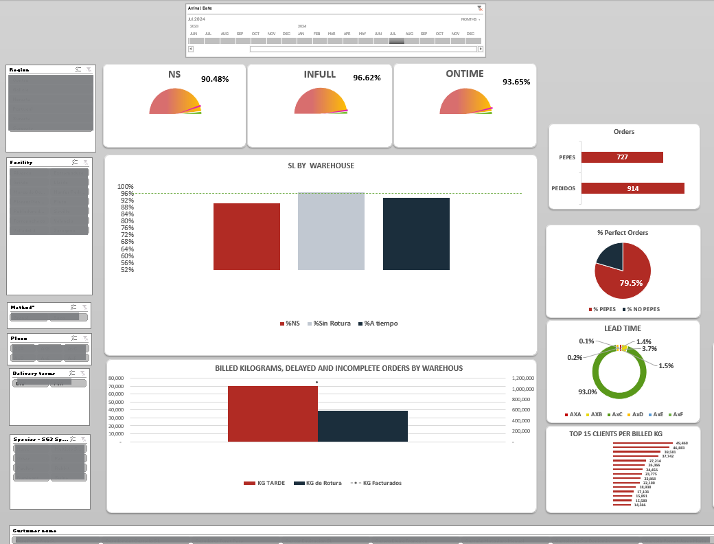
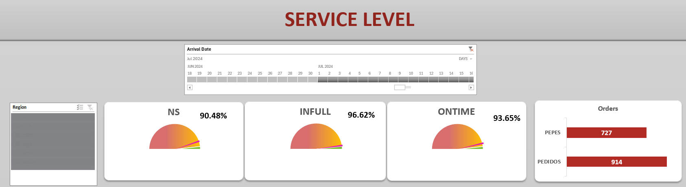
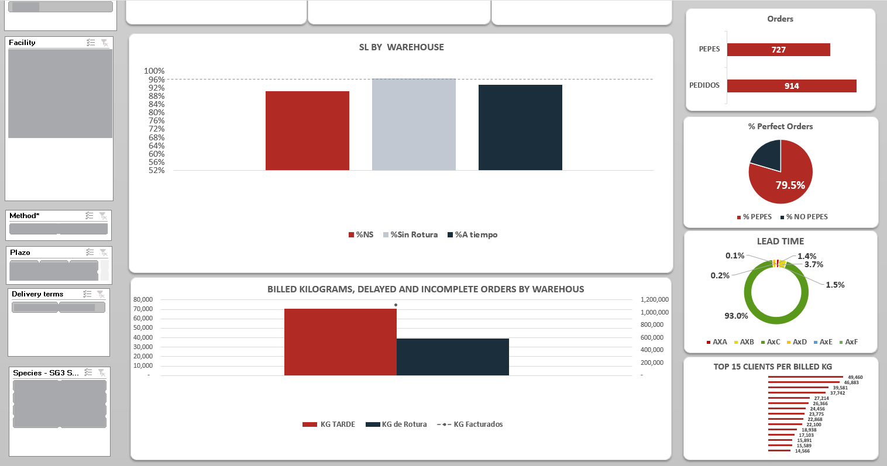
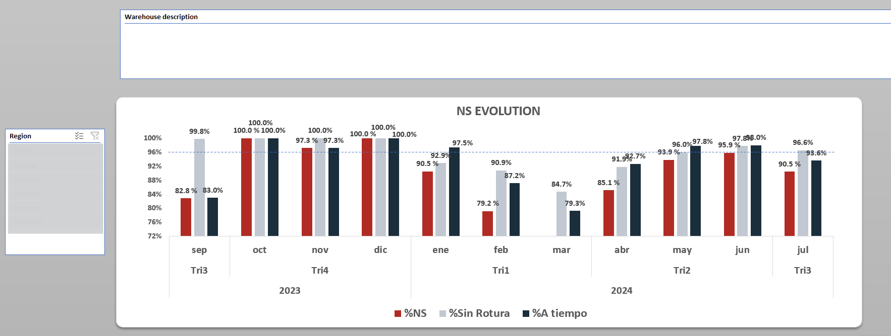

# Feed Distribution Service Level Monitoring

## Business context

A large animal feed distribution operation delivered approximately 600 tons (1200 orders) per day across multiple factories, warehouses and geographic regions.
Operations included bulk and bagged feed, multiple animal species and different delivery lead times.

Customer satisfaction depended heavily on delivery reliability and planning discipline. Same-day requests and emergency orders generated operational pressure, transport inefficiencies and service failures.

## Problem

The company lacked a daily operational monitoring system.

Performance indicators existed in raw systems but could not be evaluated in a consolidated way across days, months or years.

As a result:

-Service failures were detected only after customer complaints

-Emergency orders could not be tracked or reduced

-High-value customers were not prioritized

-Delivery reliability across warehouses was unclear

-Quality incidents were disconnected from delivery performance

-Decision making was reactive instead of preventive.

## Analytical solution

### Operational monitoring view

A centralized operational dashboard was designed to monitor logistics performance in a single view.

The system integrated the order management system with CRM incident records to evaluate not only delivery execution but customer experience.

The dashboard allowed filtering by date, warehouse, region, facility, packaging type, species and delivery lead time, enabling both daily operational control and long-term performance analysis.

Initially developed in Excel (Power Query + Power Pivot), the model was later migrated to Power BI due to data volume and historical accumulation requirements.

### Metrics designed

Key performance indicators were defined to reflect real service quality:

### Key performance indicators

INFULL
Delivered quantity vs ordered quantity

ONTIME
Delivered within agreed delivery window

Service Level (NS)
INFULL × ONTIME

Perfect Order (PEPES)
Orders with 100% service level and no quality or transport incident

Emergency Orders (AXA)
Orders requested for same-day delivery

### Operational distribution

### Warehouse performance diagnosis

kilograms delivered

bulk vs bagged distribution

performance by warehouse and region

top customers by volume

## Operational impact

### Service level evolution

The dashboard transformed daily operations from reactive to preventive monitoring.

It enabled:

-Identification of warehouses generating service failures

-Reduction strategy for emergency orders through customer planning discipline

-Prioritization of high-volume customers

-Monitoring of quality incidents together with logistics performance

-Evaluation of long-term service evolution

#### The tool became the daily operational reference for service representatives and logistics management.

Operational dashboard was designed and migrated to Power BI due to data volume and historical accumulation requirements.

### PBI implementation

## Tools and skills

-Data modeling and integration across relational sources

-Power Query and Power Pivot

-DAX calculations and time intelligence

-Power BI visualization

-Business process analysis and KPI definition
