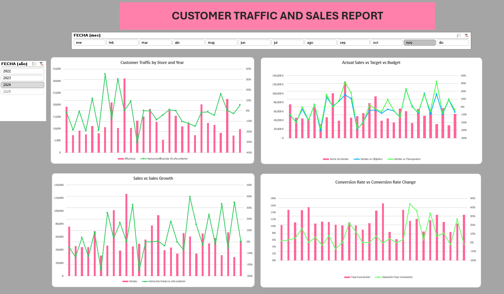
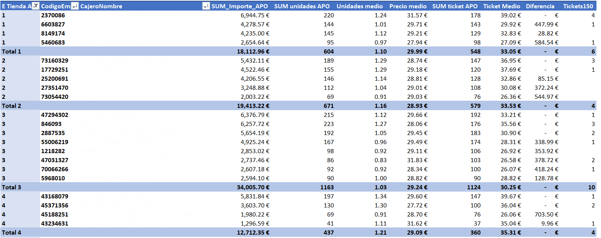

# Retail Store Sales & Traffic Analytics

## Business context

A fashion retail company operated 30 physical stores plus an online channel.
Management required visibility into commercial performance across stores, employees and customer traffic.

Despite large volumes of transactional data, performance evaluation relied on manual spreadsheets, making it difficult to compare stores, detect trends or react to operational issues.

## Problem

The company lacked a consolidated analytics system to evaluate sales behavior and store activity.

Key operational questions could not be answered efficiently:

-Which stores truly performed better vs higher traffic

-Evolution of sales across months and seasons

-Employee productivity and turnover impact

-Relationship between customer visits and revenue

-Efficient merchandise distribution to stores

Decision making depended on manual work and delayed reporting.

## Analytical solution

A set of analytical dashboards and automation tools were developed to monitor commercial performance and simplify daily operations.

The system integrated transactional sales data, store traffic counters and workforce records to allow multidimensional analysis across time, store and employee level.

Additionally, operational processes were automated to reduce repetitive manual tasks in logistics and reporting.

## Metrics designed

### Sales performance:

### Sales performance monitoring

-revenue per store

-revenue evolution by month and year

-performance by store group

### Customer traffic

### Customer traffic and sales analysis

-visitors per store

-difference between years

-Sales vs Target vs Budget

### Workforce performance

### Employee productivity tracking

- employee performance

### Operational automation

Retail operations required generating store-specific replenishment files for the warehouse system.
Originally this was performed manually by filtering spreadsheets and exporting multiple text files.

A VBA automation script was developed to:

-filter product groups by store

-generate individual distribution files

-create folder structures automatically

-export formatted .txt files for system upload

The automation script used to generate store-specific distribution files can be reviewed here:

→ [View VBA automation code](automation/store_distribution_automation.vba)

## Operational impact

The dashboards enabled store managers and headquarters to evaluate performance per time.

They allowed:

-comparison of store performance considering traffic

-detection of underperforming locations

-objective employee productivity tracking

-automated generation of distribution files for warehouse operations

The tools replaced manual reporting workflows and reduced operational overhead.

## Tools and skills

-Data modeling and relational joins

-Excel Power Query and Power Pivot

-VBA process automation

-Time-based analysis

-Business performance KPI definition

---

## Data confidentiality

All dashboards shown in this repository correspond to real professional projects.  
To preserve company confidentiality, sensitive information has been anonymized.

Axes scales, employee names, labels and selected numerical values have been modified or removed while maintaining the analytical structure and interpretation of the analysis.

